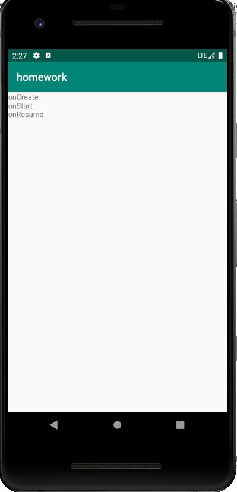
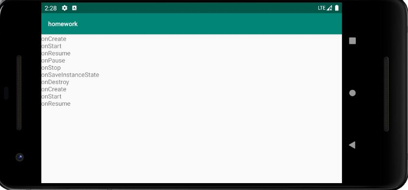
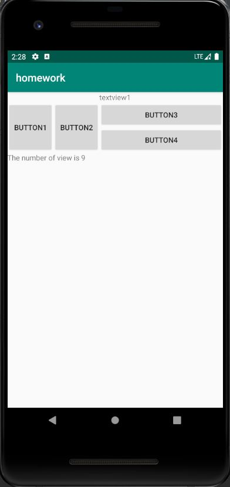
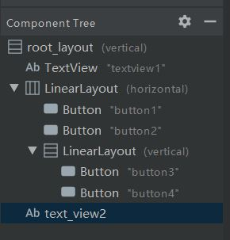
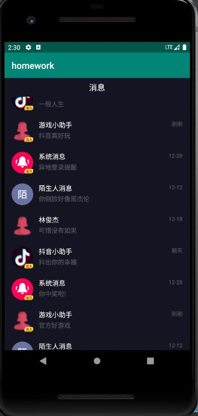
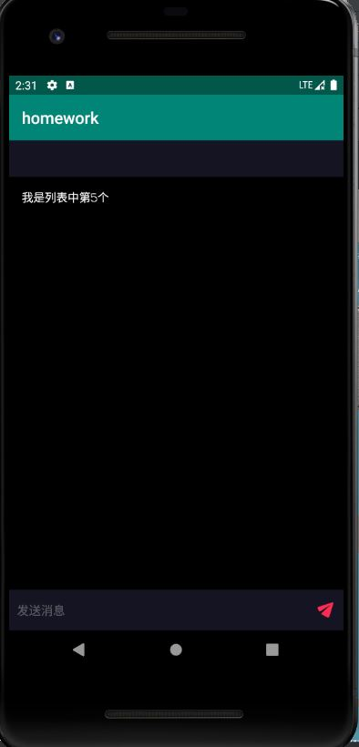

# Chapter2
Android基础UI开发
## 我的工作
- 对app工程进行了build.gradle的修改
- 写了homework工程，完成了三个作业题

**值得说明的是，由于本地SDK对应的API版本超过了28.0。0，实际为29.0.3，因此参考官方意见，迁移到了androidx**

## 截图

### 作业1

未旋转时：

旋转后：

### 作业2

界面如下图：

为证明图中真的有9个view（将viewGroup也统计在内），看下图：

### 作业3

主界面如下图：

点击后：

